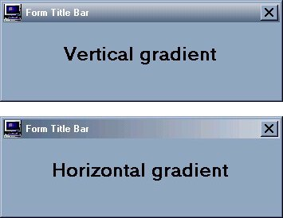



## Gradient Title Bar

### Description

This is an enhancement of Gradient Title Bar module that recreates in Win95 the look of Win98. The original module was downloaded from: http://members.tripod.com/cuinl/Tips/gradienttitle.htm. I've added the choice to use System colours by including the respective API constants. I also have simplified the usage by adding the SetBarColours routine, before in the form, now in the module.
 
### More Info
 

             |
---                |---
**Submitted On**   |2000-05-27 08:24:30
**By**             |[Raul Lopez](https://github.com/Planet-Source-Code/PSCIndex/blob/master/ByAuthor/raul-lopez.md)
**Level**          |Intermediate
**User Rating**    |4.3 (26 globes from 6 users)
**Compatibility**  |VB 5\.0, VB 6\.0
**Category**       |[Custom Controls/ Forms/  Menus](https://github.com/Planet-Source-Code/PSCIndex/blob/master/ByCategory/custom-controls-forms-menus__1-4.md)
**World**          |[Visual Basic](https://github.com/Planet-Source-Code/PSCIndex/blob/master/ByWorld/visual-basic.md)
**Archive File**   |[CODE\_UPLOAD61525272000\.zip](https://github.com/Planet-Source-Code/raul-lopez-gradient-title-bar__1-8398/archive/master.zip)

